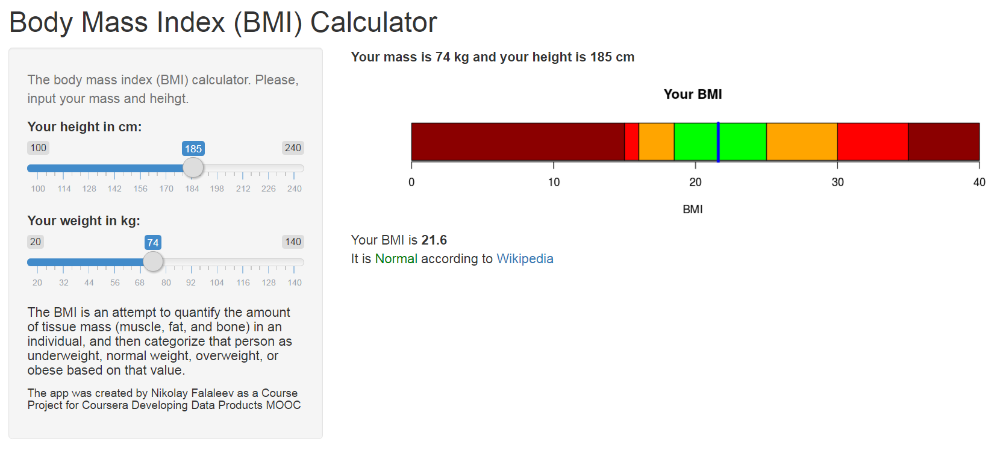

# Body mass index (BMI) calculator

Course Project for Coursera Developing Data Products MOOC
The app is a simple body mass index (BMI) calculator. It was developed as a R Shiny app.

## **[Go to the web app](https://nikolasent.shinyapps.io/bmi1/)**

## Content of this repo
- `scr` a directory with the source code for the project. See `server.R` and `ui.R` files in the repo.
- `bmi_presentation.Rpres` a presentation of the project. Is is also available [online](http://rpubs.com/nikolasent/bmi1). The presentation contains more details about the app.

[The app](https://nikolasent.shinyapps.io/bmi1/) itself is available on the Shiny server.

More about the BMI Categories on *[Wikipedia](https://en.wikipedia.org/wiki/Body_mass_index#Categories)*.
